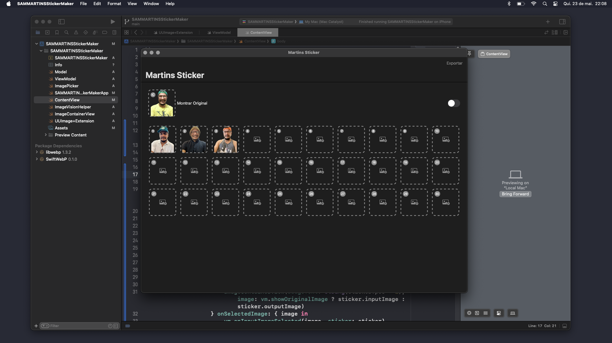
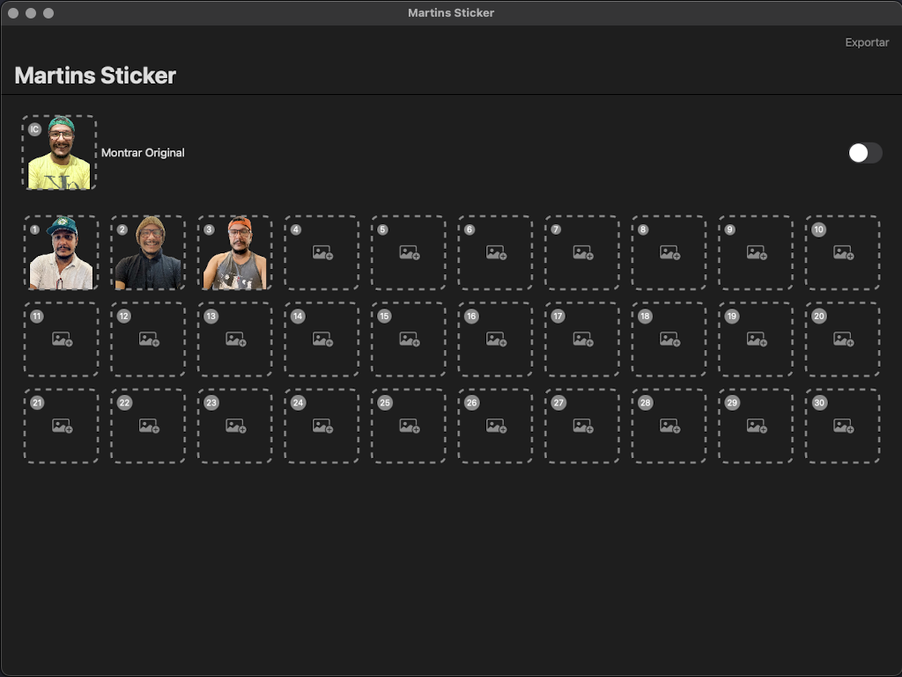
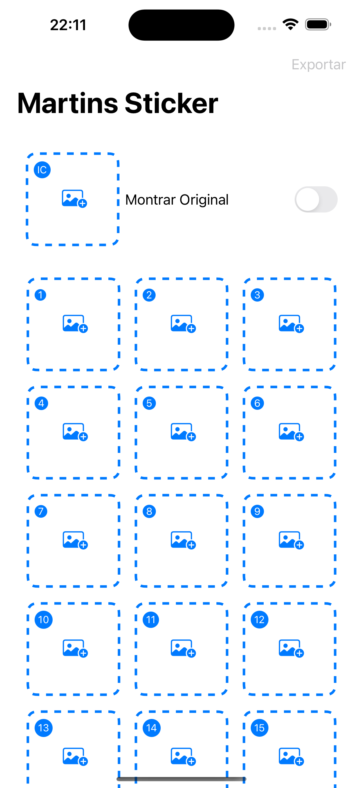
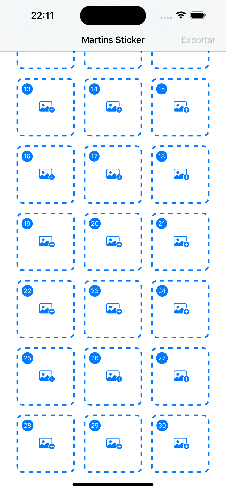

<h2 align="center">
    CRIADOR DE STICKER PARA WHATSAPP
    <br />
    Tecnologia Utilizada: SwiftUI <br />
    Plataforma: iOS (iPhone)
</h2>

<h4 align="center">
    🚀 PROJETO CONCLUÍDO 🚀
</h4>

## Informação do projeto

O Criador de Stickers é um aplicativo inovador desenvolvido em SwiftUI que permite aos usuários criar seus próprios stickers personalizados a partir de fotos da galeria do iPhone. Com uma interface intuitiva e fácil de usar, os usuários podem transformar suas fotos favoritas em stickers divertidos e únicos que podem ser enviados e compartilhados diretamente no WhatsApp.

## Funcionalidades Principais

    Importação de Fotos:
        * Selecione fotos da galeria do iPhone para transformar em stickers.
    Edição de Stickers:
        * Corte e ajuste as fotos para criar stickers personalizados.
    Adicione efeitos, bordas e textos para personalizar ainda mais os stickers.
        * Exportação para WhatsApp:
    Salve e exporte os stickers diretamente para o WhatsApp.
        * rie pacotes de stickers e adicione-os ao WhatsApp para fácil acesso e compartilhamento.
    Interface Intuitiva:
        * Design amigável e fácil de navegar, permitindo que qualquer usuário, independentemente de sua experiência técnica, crie stickers rapidamente.
    Armazenamento e Gerenciamento:
        * Salve os stickers criados no aplicativo para uso futuro.
        * Gerencie pacotes de stickers, permitindo adicionar, remover ou editar stickers existentes.

## Objetivo do projeto

O Criador de Stickers visa fornecer uma maneira divertida e criativa para os usuários personalizarem suas mensagens no WhatsApp, transformando momentos especiais em stickers únicos que podem ser compartilhados com amigos e família.

## Público-Alvo

Qualquer usuário de iPhone que utilize o WhatsApp e deseja adicionar um toque pessoal às suas conversas, criando stickers personalizados a partir de suas próprias fotos.

## Imagem do projeto

<div style="display: flex; flex-direction: 'row';">
    
    
</div>

### Projeto executado no MacBook air m1

<div style="display: flex; flex-direction: 'row';">
    
</div>

### Projeto executado no aparelho celular iPhone

<div style="display: flex; flex-direction: 'row';">
    
    
</div>

## Executar o projeto

```bash
    # Clone o Repositório:
    $ git clone https://github.com/SilvaneiMartins/criador-sticker-whatsapp

    # Entre no Diretório:
    cd criador-sticker-whatsapp

    # Executar o projeto
    # Obs. caso de erro não esquecer de adicionar a SwiftWebP ao projeto
    $ atraves_x_code
```

## Adicionar SwiftWebP ao projeto

```bash
    # acessar as configurações do projeto em package dependências e adicionar o link.
    $ https://github.com/alfianlosari/SwiftWebP
```

## Licença

Este projeto é licenciado sob [CC0 1.0 Universal]. Consulte o arquivo [LICENSE](https://github.com/SilvaneiMartins/criador-sticker-whatsapp/blob/master/LICENSE) para obter detalhes.

## Ferramentas adicionais

- [WhatsApp Stickers](https://github.com/WhatsApp/stickers) ferramentas que redireciona para o WhatsApp.
- [SwiftWebP](https://github.com/alfianlosari/SwiftWebP) decodificador e codificador Swift WebP para UIKit UIImage.

## Contribuição com o projeto

Se você quiser contribuir para este projeto, siga estas etapas:

    * Fork este repositório
    * Crie uma nova branch (git checkout -b feature/)
    * Faça commit de suas alterações (git commit -am 'Adicionar nova funcionalidade')
    * Faça push para a branch (git push origin feature/)
    * Crie um novo Pull Request

## Notas Adicionais

    * Este projeto utiliza SwiftUI, a moderna framework de UI declarativa da Apple, aproveitando ao máximo os recursos e capacidades do iOS para proporcionar uma experiência de usuário fluida e responsiva.

    * A integração direta com o WhatsApp segue as diretrizes e APIs oficiais para garantir compatibilidade e funcionalidade perfeita.

## Informação do Desenvolvedor

<a href="https://github.com/SilvaneiMartins">
    
    <br />
    <sub>
        <b>Silvanei de Almeida Martins</b>
    </sub>
</a>
     <a href="https://github.com/SilvaneiMartins" title="Silvanei martins" >
 </a>
<br />
🚀 Feito com ❤️ por Silvanei Martins
